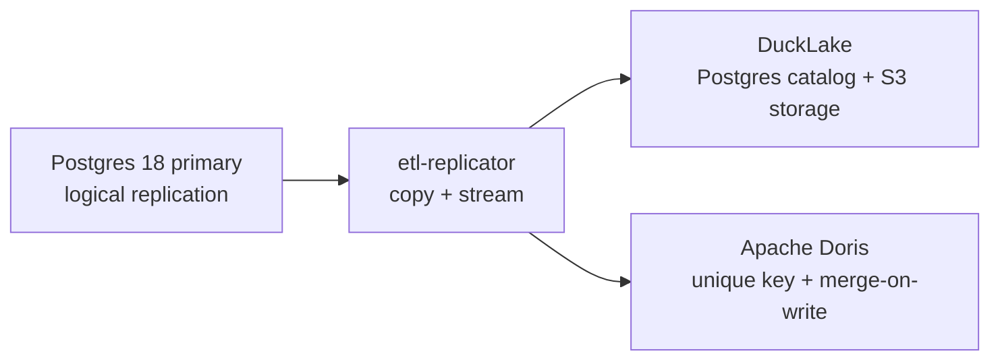

# ETL

A Rust service that turns a PostgreSQL 18 primary into a near-real-time
analytical replica.

This is a fork of [supabase/etl](https://github.com/supabase/etl) trimmed to one
job: keep an analytical store that mirrors the current state of a Postgres
source. It is not an audit log, and it is not a general-purpose replication
framework.



## What it guarantees

| Property | Behaviour |
| --- | --- |
| Consistency | Eventual. Replication is at-least-once, and every destination write is idempotent. |
| Data shape | Current state of the source, not an event log. Updates overwrite and deletes remove. |
| Schema changes | Added, dropped, renamed, and retyped columns are followed, as are table renames. |
| Types | Strongly typed wherever the destination can express the Postgres type, with text as a lossless fallback. |
| Tables without a key | A source table with no primary key and no `replica identity full` degrades to an append-only log, because the source never sends a key image. |

## Destinations

| Feature | Destination | Notes |
| --- | --- | --- |
| `ducklake` | DuckLake | Postgres catalog plus local or S3-compatible storage. Replay epochs, applied-batch markers, and streaming progress make retries idempotent. |
| `doris` | Apache Doris | Unique-key tables with merge-on-write. Stream Load labels derived from the source position make retries idempotent. |

## Requirements

- PostgreSQL 18 source with `wal_level = logical`. Postgres 17 is also covered by CI.
- A Postgres instance for the DuckLake catalog, separate from the source.
- S3-compatible object storage for DuckLake data files. The development stack uses
  [rustfs](https://rustfs.com); MinIO works the same way.
- A Doris 4.x cluster when the Doris destination is enabled.

## Running

The replicator loads its configuration from `configuration/{environment}.yaml`
inside `crates/etl-replicator`, with `APP_`-prefixed environment overrides.

```bash
cd crates/etl-replicator
APP_ENVIRONMENT=dev cargo run --release
```

See [DEVELOPMENT.md](DEVELOPMENT.md) for the local stack, migrations, and tests.

## Performance

Measured on one developer machine (WSL2 Debian, Postgres 18 source, Postgres 18
DuckLake catalog, local data path so object-storage latency stays out of the
numbers). Throughput is `rows * 1000 / elapsed_ms`; these are single observations
rather than percentiles, and the source write time is reported alongside rather
than subtracted, so each figure is end to end.

| Scenario | Rows | Source write | To the replica | Rows/s |
| --- | --- | --- | --- | --- |
| Initial copy, catching up a backlog | 1,000,000 | 7,428 ms | 33,703 ms | 29,670 |
| Streaming insert | 1,000,000 | 8,393 ms | 27,451 ms | 36,428 |
| Streaming insert, 4 tables | 750,000 | 6,087 ms | 16,360 ms | 45,843 |
| Interleaved insert/update/delete | 500,000 | 22,495 ms | 29,949 ms | 16,695 |
| Warm update | 1,000,000 | 9,787 ms | 34,119 ms | 29,309 |
| Warm delete | 500,000 | 1,013 ms | 10,217 ms | 48,938 |

Streaming throughput sits in the same range across inserts, updates, and deletes,
because a batch collapses by key into one delete matched through staged keys plus
one insert, whatever mix of operations it contains. The interleaved figure is
lower mostly on the source side: generating it row by row in a PL/pgSQL loop
takes 22 s of the 30 s.

Scale matters when reading these. At 100,000 rows the same scenarios measure
roughly 25,000 rows/s, because a fixed cost of about 1.5 s per scenario — the
batch fill window, connection setup, and the benchmark's own polling granularity
— is 40% of the total there and 4% here. Compare figures at the same row count.

Streaming inserts are within 3% of what the source can deliver: draining the same
rows from an equivalent slot with `pg_recvlogical` into `/dev/null`, with no row
decoding and no destination, reaches 38,630 rows/s against the 37,601 above. Going
materially faster requires several replication slots decoding in parallel rather
than changes to this code.

`scripts/bin/bench-replica.sh` reproduces these numbers, and
[DEVELOPMENT.md](DEVELOPMENT.md) documents the measurement scope, the known gaps,
and the local environment traps that distort results.

## Recovering from divergence

The replica holds no authority over the data, so recovery is a fresh copy rather
than a repair. `scripts/bin/verify-replica.sh` compares source row counts against
the replica, and `etl-resync` resets table state so the replicator drops the
destination table and copies it again.

```bash
scripts/bin/verify-replica.sh --destination doris
etl-resync --table-id "$(psql "$SOURCE_DSN" -qtAc "select 'public.orders'::regclass::oid")"
```

Run `etl-resync` while the replicator is stopped, then start it to perform the
copy.

## License

Apache-2.0. See `LICENSE` for details.
