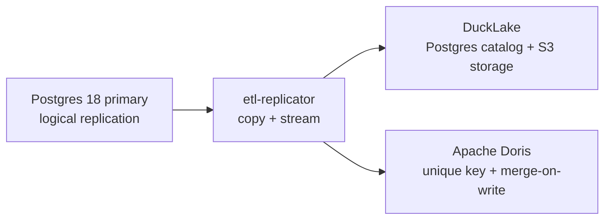

# ETL

A Rust service that turns a PostgreSQL 18 primary into a near-real-time
analytical replica.

This is a fork of [supabase/etl](https://github.com/supabase/etl) trimmed to one
job: keep an analytical store that mirrors the current state of a Postgres
source. It is not an audit log, and it is not a general-purpose replication
framework.



## What it guarantees

| Property | Behaviour |
| --- | --- |
| Consistency | Eventual. Replication is at-least-once, and every destination write is idempotent. |
| Data shape | Current state of the source, not an event log. Updates overwrite and deletes remove. |
| Schema changes | Added, dropped, renamed, and retyped columns are followed, as are table renames. Dropping and retyping discard data, so both are switchable. |
| Types | Strongly typed wherever the destination can express the Postgres type, with text as a lossless fallback. |
| Tables without a key | A source table with no primary key and no `replica identity full` degrades to an append-only log, because the source never sends a key image. |

## Destinations

| Feature | Destination | Notes |
| --- | --- | --- |
| `ducklake` | DuckLake | Postgres catalog plus local or S3-compatible storage. Replay epochs, applied-batch markers, and streaming progress make retries idempotent. |
| `doris` | Apache Doris | Unique-key tables with merge-on-write. Stream Load labels derived from the source position make retries idempotent. |

## Requirements

- PostgreSQL 18 source with `wal_level = logical`. Postgres 17 is also covered by CI.
- A Postgres instance for the DuckLake catalog, separate from the source.
- S3-compatible object storage for DuckLake data files. The development stack uses
  [rustfs](https://rustfs.com); MinIO works the same way.
- A Doris 4.x cluster when the Doris destination is enabled.

## Running

The replicator loads its configuration from `configuration/{environment}.yaml`
inside `crates/etl-replicator`, with `APP_`-prefixed environment overrides.

```bash
cd crates/etl-replicator
APP_ENVIRONMENT=dev cargo run --release
```

See [DEVELOPMENT.md](DEVELOPMENT.md) for the local stack, migrations, and tests.

### Schema change policy

Adding and renaming a column only add information, so both are always followed.
Dropping a column, retyping one, and emptying a table on `TRUNCATE` discard data
in the replica, so each can be switched off per destination:

```yaml
destination:
  ducklake:
    schema_follow:
      drop_column: false
      change_type: true
      truncate: true
```

A change that is not followed is logged and skipped; the source and the replica
then differ in shape, and `etl-resync` is the way back to a matching one.

## Performance

Measured on one developer machine: WSL2 Debian 13, 12 vCPU, 30 GB, Docker 26.1.5.
The source is Postgres 18.4 with `wal_level = logical`, the DuckLake catalog is a
second Postgres 18.4 instance, and the lake data path is a local directory so
object-storage latency stays out of the numbers.

**Both Postgres instances run on the host network.** That is the standard
configuration for these figures, because a published Docker port becomes the
throughput limit. Draining the same 1,000,000-change backlog with
`pg_recvlogical`, no row decoding on our side and no destination:

| Path from consumer to source | rows/s |
| --- | --- |
| None: `pg_logical_slot_peek_binary_changes` in a SQL backend | 258,732 |
| Unix domain socket | 154,966 |
| Host network, TCP to `127.0.0.1` | 142,877 |
| TCP over the Docker bridge | 69,842 |
| TCP through a published port and Docker's userland proxy | 57,763 |

Decoding costs 3.9 µs per change. Host networking and a unix socket land within
8% of each other, so TCP itself is not expensive — the extra hops are. A published
port more than halves the rate, because `docker-proxy` copies every packet through
a userland process. Colocating the replicator with its source is the largest
transport lever and it needs no code.

Throughput below is `rows / (source write + destination drain)`; both parts count,
because the replicator is already consuming while the source is still writing, and
charging every row to the drain alone reads a fifth to a third high. The initial
copy is the exception, since the replicator is stopped for the whole source write.
Two observations per scenario, not percentiles.

| Scenario | Rows | Source write | Drain | DuckLake rows/s |
| --- | --- | --- | --- | --- |
| Warm delete | 500,000 | 0.9 s | 4.6 s | 91,558 / 89,526 |
| Initial copy, catching up a backlog | 1,000,000 | 3.4 s | 14.5 s | 68,799 / 64,103 |
| Streaming insert, 4 tables | 750,000 | 3.1 s | 8.9 s | 62,568 / 60,803 |
| Streaming insert | 1,000,000 | 3.9 s | 15.7 s | 51,164 / 53,262 |
| Warm update | 1,000,000 | 4.6 s | 18.8 s | 42,731 / 42,364 |
| Interleaved insert/update/delete | 500,000 | 7.8 s | 14.8 s | 22,142 / 21,440 |

**The bottleneck is this code, not the source and not the destination.** A streaming
insert runs at 37% of the 142,877 rows/s the source hands over on the same path.
Per change that is 18.8 µs against the source's 7.0. The destination accounts for
4.1 µs of it: a full six-scenario run wrote 4.5 M streamed rows through DuckLake in
18.6 s of summed stage time, which is roughly 244,000 rows/s of capacity. That
leaves about 7.7 µs per change in decoding, event construction, and batching
between the socket and the destination write.

Two things move that figure a long way, and neither needs code. Both measured at
1,000,000 rows:

| Configuration | Streaming insert |
| --- | --- |
| Defaults, six-column row with `jsonb` and `timestamptz` | 51,198 |
| `batch.max_bytes` raised to 64 MiB | 65,163 |
| 64 MiB and a three-column row of `bigint`, `text`, `numeric` | 117,274 |

The 8 MiB default caps a batch at a median 16,772 rows, which is 223 DuckLake
transactions across a six-scenario run against 68 at 64 MiB. Raising
`batch.max_fill_ms` past its 500 ms default does not help further. Row shape is the
larger factor: every cell arrives as Postgres text and is parsed into a typed value
before it is staged, so `jsonb`, `timestamptz`, and `numeric` columns are
substantially more expensive per row than integers and text. At 5,000,000 rows on
the narrow shape the streaming insert reaches 124,672 and the initial copy 375,742,
so these figures scale rather than degrade.
[DEVELOPMENT.md](DEVELOPMENT.md) has the stage breakdown and a comparison against
another implementation on the same machine.

Streaming throughput sits in the same range across inserts, updates, and deletes,
because a batch collapses by key before it is written: DuckLake applies one delete
matched through staged keys plus one insert, whatever mix of operations the batch
contains. The median batch carries 16,772 rows. The interleaved figure is the
outlier on both sides — the source spends 35% of the measurement generating the
rows one at a time in a PL/pgSQL loop, and the surviving half of the rows costs a
delete pass as well as an insert.

Scale matters when reading these. At 100,000 rows a streaming insert measures
37,258 rows/s instead of 53,262, because a fixed cost of roughly 0.9 s per scenario
— the batch fill window, connection setup, and the benchmark's own polling
granularity — dominates there. The initial copy is the extreme case: about 8.8 s of
replicator start, DuckDB extension load, and catalog bootstrap, so 100,000 rows
measure 10,527 rows/s against 68,799 at 1,000,000. Compare figures at the same row
count and over the same transport.

Two protocol options are off in this code today and both were measured to help,
though only through a published port, so the sizes need redoing: `binary 'true'`
took a drain from 53,513 to 59,719 rows/s, and for one large mixed transaction of
1,250,000 changes `streaming 'on'` took 50,709 to 66,988 changes/s while removing a
216 MB reorder-buffer spill.

Sharding across replication slots scales sublinearly: 1,000,000 rows over four
tables drained at 58,779 rows/s through one slot, 100,010 through two, and 130,856
through four, because every walsender still reads all of the WAL. Those were also
measured through a published port.

The Doris destination was not re-measured in this round, because the official
Doris 4.1.3 frontend image crash-loops on this WSL2 kernel; see
[DEVELOPMENT.md](DEVELOPMENT.md).

`scripts/bin/bench-replica.sh` reproduces these numbers; set `PG_HOST`,
`PG_PORT`, `CATALOG_HOST`, and `CATALOG_PORT` at host-network instances, because
the defaults use the published ports. [DEVELOPMENT.md](DEVELOPMENT.md) documents
the measurement scope, the known gaps, and the local environment traps that
distort results.

## Recovering from divergence

The replica holds no authority over the data, so recovery is a fresh copy rather
than a repair. `scripts/bin/verify-replica.sh` compares source row counts against
the replica, and `etl-resync` resets table state so the replicator drops the
destination table and copies it again.

```bash
scripts/bin/verify-replica.sh --destination doris
etl-resync --table-id "$(psql "$SOURCE_DSN" -qtAc "select 'public.orders'::regclass::oid")"
```

Run `etl-resync` while the replicator is stopped, then start it to perform the
copy.

## License

Apache-2.0. See `LICENSE` for details.
